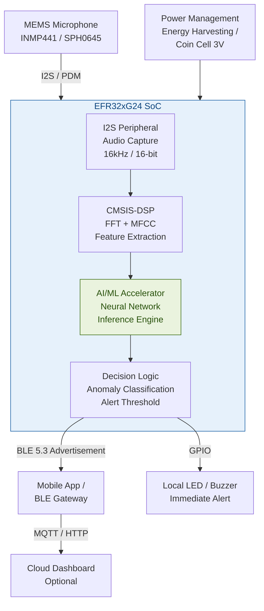
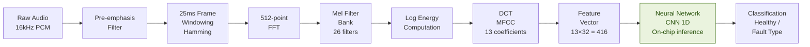
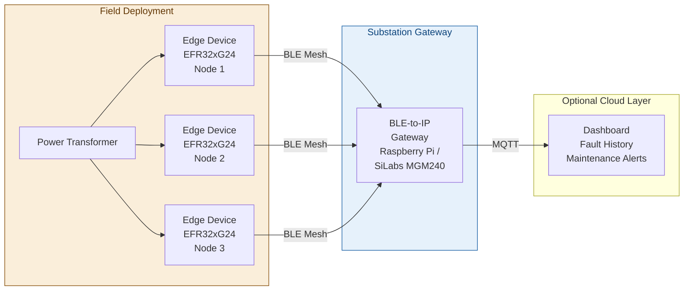

# On-Device Acoustic Anomaly Detection for Power Transformer Fault Prediction

> **Silicon Labs Centre of Innovation in IoT — Project Submission**
> Detecting transformer faults in real-time using TinyML inference on the EFR32xG24 AI/ML hardware accelerator — no cloud, no latency, no data privacy risk.

---

## 1. Project Overview

### Problem Statement

Power transformers are the backbone of electrical distribution infrastructure. In India alone, unexpected transformer failures cause thousands of hours of unplanned outages every year, with replacement and downtime costs running into crores of rupees. In hilly and rural regions like Uttarakhand, a single failed transformer can cut power to entire villages for days — since repair crews and replacement units must travel long distances over difficult terrain.

The core problem is that transformer faults do not happen instantly. They develop gradually over weeks or months, producing distinct acoustic signatures long before catastrophic failure:

- **Corona discharge** — a high-frequency hissing or crackling sound caused by electrical stress in insulation
- **Winding looseness** — a rhythmic buzzing at 100 Hz (double the supply frequency) caused by loose laminations or windings
- **Oil degradation** — a change in the baseline hum profile as cooling oil loses its dielectric properties
- **Partial discharge** — high-frequency acoustic pulses indicating insulation breakdown in progress

Currently, utilities either rely on scheduled maintenance (which misses developing faults) or expensive online monitoring systems that require continuous internet connectivity and cloud infrastructure — unviable for remote substations.

### Proposed Solution

This project proposes an ultra-low-power, standalone IoT edge device that:

1. Continuously monitors transformer acoustic emissions using a MEMS microphone
2. Extracts MFCC (Mel-Frequency Cepstral Coefficient) spectral features from the audio in real time
3. Runs a trained neural network classifier **entirely on-chip** using the EFR32xG24's dedicated AI/ML hardware accelerator
4. Classifies the transformer state as: `HEALTHY`, `CORONA_DISCHARGE`, `WINDING_FAULT`, or `PARTIAL_DISCHARGE`
5. Transmits a BLE alert to a nearby gateway or mobile app **only when an anomaly is detected** — preserving battery life and requiring zero always-on connectivity

The device requires no internet connection, no cloud subscription, and no continuous data transmission. It runs on a coin cell or small battery for months and can be retrofitted onto any existing transformer without modifying the transformer itself.

---

## 2. Technical Architecture

### System Block Diagram



### Data Flow Pipeline



### Deployment Architecture



---

## 3. Technologies Used

### Wireless Technologies
- **Bluetooth Low Energy (BLE) 5.3** — for fault alert transmission to gateway or mobile app
- **Bluetooth Mesh** — for multi-node deployments across a substation

### SDKs and Frameworks
- **Gecko SDK (GSDK) v4.4+** — Silicon Labs primary wireless SDK
- **CMSIS-DSP** — ARM's optimized DSP library for FFT and MFCC computation on Cortex-M33
- **TensorFlow Lite for Microcontrollers (TFLM)** — neural network inference runtime
- **Edge Impulse MLTK (Machine Learning Toolkit)** — Silicon Labs' TinyML toolchain for model training, optimization, and deployment

### Programming Languages
- **C / C++** — firmware development
- **Python** — data collection scripts, model training pipeline (Edge Impulse / MLTK)

### Tools
- **Simplicity Studio 5** — Silicon Labs IDE for EFR32 development
- **Edge Impulse Studio** — web-based TinyML platform for dataset management, training, and deployment
- **STM32CubeIDE** — used for development prototype on STM32F4
- **Wireshark + Bluetooth sniffer** — BLE packet debugging

---

## 4. Hardware Components

### Silicon Labs Hardware (Production Target)
| Component | Part Number | Purpose |
|---|---|---|
| Wireless SoC | EFR32xG24 (EFR32MG24) | Main MCU with AI/ML accelerator + BLE |
| Development Kit | xG24-DK2601B | Development and prototyping |
| Radio Board | BRD4187C | EFR32xG24 radio board for Pro Kit |

### External Hardware
| Component | Purpose |
|---|---|
| INMP441 MEMS Microphone | I2S digital microphone for acoustic capture |
| SPH0645LM4H (alternative) | PDM microphone — lower power option |
| CR2032 Coin Cell / LiPo 3.7V | Power supply |
| Custom weatherproof enclosure | IP65 rated housing for outdoor transformer mounting |

### Development Prototype Hardware (Current)
| Component | Purpose |
|---|---|
| STM32F4 Nucleo (STM32F411RE) | Development prototype board |
| INMP441 breakout module | I2S microphone interfacing |
| HC-05 / HM-10 BLE module | BLE transmission for prototype |

---

## 5. Working Methodology / Flow of Project

### Phase 1 — Data Collection
1. Record audio from healthy transformers (60Hz / 100Hz hum baseline) — minimum 10 minutes per class
2. Record or synthesize audio signatures for fault types: corona discharge, winding looseness, partial discharge
3. Use publicly available transformer acoustic datasets (IEEE, IEC archives) to augment training data
4. Label and upload all samples to Edge Impulse Studio

### Phase 2 — Feature Engineering
1. Configure DSP block in Edge Impulse: 16kHz sample rate, 25ms window, 13 MFCC coefficients, 26 Mel filters
2. Verify MFCC spectrograms visually — healthy and fault classes must be visually separable
3. Export feature vectors for model training

### Phase 3 — Model Training
1. Train a 1D CNN classifier on Edge Impulse (target: <50KB RAM, <100KB Flash for EFR32xG24)
2. Optimize using EON Tuner — Edge Impulse's automated model compression tool
3. Validate: target >92% accuracy on test set, <50ms inference latency
4. Export as Silicon Labs MLTK-compatible C++ library

### Phase 4 — Firmware Development
1. Integrate Edge Impulse library into Simplicity Studio project (GSDK v4.4+)
2. Configure I2S peripheral for continuous audio capture via DMA
3. Implement ring buffer for real-time audio streaming to inference pipeline
4. Implement BLE advertisement with custom fault notification GATT profile
5. Implement power management: deep sleep between inference cycles

### Phase 5 — Validation & Testing
1. Prototype validation on STM32F411 Nucleo (CMSIS-DSP + TFLite Micro)
2. Port and validate on EFR32xG24 Dev Kit
3. Field test against recorded transformer audio samples
4. Measure power consumption using Simplicity Studio Energy Profiler

---

## 6. Circuit Design / Proposed Implementation

### INMP441 to EFR32xG24 I2S Connection

```
INMP441          EFR32xG24
--------         ----------
VDD      ──────  3.3V
GND      ──────  GND
WS       ──────  PC3  (I2S_WS  / LRCLK)
SCK      ──────  PC4  (I2S_SCK / BCLK)
SD       ──────  PC5  (I2S_SD  / DATA)
L/R      ──────  GND  (Left channel select)
```

### Audio Capture Configuration
- Sample rate: 16,000 Hz
- Bit depth: 16-bit
- Interface: I2S (Inter-IC Sound)
- Buffer: 512 samples per frame (32ms)
- DMA-driven: CPU free during capture

### Power Budget (Estimated)
| Mode | Current | Duration |
|---|---|---|
| Active inference | ~4.5 mA | ~45ms every 500ms |
| BLE advertisement (fault) | ~6 mA | ~10ms (on fault only) |
| Deep sleep | ~1.2 µA | remainder |
| **Average** | **~0.45 mA** | — |

Estimated battery life on 220mAh CR2477: **~20 days continuous**
With energy harvesting from transformer stray field: **indefinite**

---

## 7. Current Progress Status and Future Scope

### Current Status
- [x] Problem statement and system architecture defined
- [x] DSP pipeline designed (FFT → MFCC → CNN)
- [x] Hardware selection finalized
- [x] Development prototype hardware procured (STM32F4 Nucleo + INMP441)
- [ ] Training dataset collection in progress (using IEEE transformer acoustic archives)
- [ ] Edge Impulse model training — in progress
- [ ] STM32F4 prototype firmware — in development
- [ ] EFR32xG24 port — planned after prototype validation

### Future Scope
1. **Multi-fault severity grading** — classify not just fault type but severity level (warning / critical / imminent failure)
2. **Energy harvesting** — power the device entirely from the transformer's stray electromagnetic field using a pickup coil, eliminating batteries
3. **Federated learning** — multiple deployed nodes collaboratively improve the shared model without sending raw audio data anywhere, preserving privacy
4. **Matter/Thread integration** — upgrade BLE-only to a full Thread mesh for large substation deployments using Silicon Labs' Matter stack
5. **Vibration fusion** — add accelerometer (MPU6050) alongside microphone for multi-modal anomaly detection, improving accuracy

---

## 8. Software Components / Dependencies

### Silicon Labs Dependencies
| Dependency | Version |
|---|---|
| Gecko SDK (GSDK) | v4.4.0+ |
| Simplicity Studio | v5 |
| Silicon Labs MLTK | v0.19+ |
| EFR32xG24 Dev Kit Board Support | latest |

### External Dependencies
| Dependency | Purpose |
|---|---|
| Edge Impulse C++ SDK | Inference library (auto-generated) |
| CMSIS-DSP | FFT, MFCC, filter operations |
| TensorFlow Lite for Microcontrollers | Neural network runtime |
| FreeRTOS (optional) | Task scheduling for audio pipeline |

---

## 9. Licensing

This project is licensed under the **Apache License 2.0**.

Third-party components:
- CMSIS-DSP: Apache 2.0 (ARM)
- TensorFlow Lite Micro: Apache 2.0 (Google)
- Edge Impulse C++ library: Apache 2.0 (Edge Impulse)
- Gecko SDK: [Silicon Labs Master Software License Agreement (MSLA)](https://www.silabs.com/about-us/legal/master-software-license-agreement)

See [LICENSE](./LICENSE) for full terms.

---

## 10. Maintainers / Contacts

| Name | Role | Contact | GitHub |
|---|---|---|---|
| Shubh Verma | Project Maintainer | shubh.verma_ec23@gla.ac.in | [User8085](https://github.com/User8085) |

**Institution:** GLA University
**Programme:** B.Tech Electronics & Communication Engineering (Minor: Computer Science)
**Year:** 4th Year (2024–25)

---

*Submitted as part of the Silicon Labs Centre of Innovation in IoT Campaign.*
*Repository: [SiliconLabsSoftware/community-creations](https://github.com/SiliconLabsSoftware/community-creations)*
